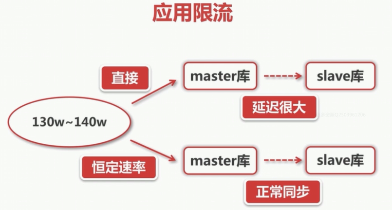

<!-- GFM-TOC -->
* [高并发](#高并发)
    * [扩容](#扩容)
    * [缓存](#缓存)
    * [消息队列](#消息队列)
    * [应用拆分](#应用拆分)
    * [应用限流](#应用限流)
    * [服务降级与服务熔断](#服务降级与服务熔断)
    * [数据库切库分库分表](#数据库切库分库分表)
    * [高可用](#高可用)
<!-- GFM-TOC -->

# 高并发

## 扩容

- 垂直扩容（纵向扩展）：提高系统部件能力
- 水平扩容（横向扩展）：增加更多系统成员来实现

**扩容-数据库**
- 读操作扩展：memcache、redis、CDN等缓存
- 写操作扩展：Cassandra、Hbase等

## 缓存

#### 缓存特征
- 命中率：命中数 / （命中数 + 未命中数）
- 最大元素（空间）
- 清空策略：FIFO、LFU、LRU、过期时间、随机等

#### 缓存命中率因素
- 业务场景和业务需求
- 缓存设计（粒度和策略）
- 缓存容量和基础设施

#### 缓存分类和应用场景
- 本地缓存：编程实现（成员变量、局部变量、静态变量）、Guava Cache
- 分布式缓存：Memcache、Redis

#### 高并发下缓存常见问题

1. 缓存一致性

|SUCCESS|FAILED|QUESTION|
|-|-|-|
|更新数据库成功|更新缓存失败|数据不一致|
|更新缓存成功|更新数据库失败|数据不一致|
|更新数据库成功|淘汰缓存失败|数据不一致|
|淘汰缓存成功|更新数据库失败|查询缓存miss|

**解决办法:**

[详细介绍双写、失效](https://www.cnblogs.com/lzghyh/p/13276514.html)

① `双删延时的解决办法`: 先删除缓存数据，然后再更新数据库数据，最后再隔固定的时间再次删除缓存。

② `双写模式`: 先写数据库，再写缓存

③ `更新数据库产生的binlog订阅(使用canal)`: 将有变化的key记录下来，并且尝试去不断的去删除缓存(如果上次删除缓存失败)

2. 缓存击穿问题

**eg.** redis中存储的是热点数据，当高并发请求访问redis热点数据的时候，如果redis中数据过期了，会造成缓存击穿，请求都打在了数据库上。

**解决方法：** 使用互斥锁，只让一个请求去load DB，成功之后重新写缓存，其余请求没有获取到互斥锁，可以尝试重新获取缓存中的数据。

3. 缓存穿透问题

**eg.** 大量的请求的key在缓存中根本不存在，导致请求直接到了数据库上，大量请求导致数据库异常。

**解决办法:** 

①最基本的做好参数校验，一些不合法的参数请求直接抛出异常返回给客户端

②缓存无效key

③使用有效的机制(比如布隆过滤器）来拦截不合法的key值等。

4. 缓存的雪崩现象

**eg.** 缓存同一时间大面积失效，这个时候又来一波（或后面的）请求到数据库上，导致数据库短时间内承受大量请求而崩掉。

**解决方法：** 

①事前：尽量保证真个redis集群的高可用性，发现机器宕机尽快补上。选择合适的内存淘汰策略

②事中：本地缓存 + hystrix限流&降级，避免MySQL崩掉

③利用redis持久化机制保存的数据尽快恢复缓存

## 消息队列

（1） 消息队列特性
- 与业务无关：只做消息分发
- FIFO：先投递先到达
- 容灾：节点的动态增删和消息持久化
- 性能：吞吐量提升，系统内部通信效率提高

（2) 消息队列的好处

- 业务解耦
- 最终一致性：要么成功、要么失败
- 广播
- 错峰与流控

## 应用拆分

1. 应用拆分原则

- 业务优先：边界切分
- 循序渐进：边拆分、边测试
- 兼顾技术：重构、分层
- 可靠测试
- 应用之间的通信：RPC(dubbo等)，消息队列
- 应用之间数据库设计：每个应用都有独立数据库
- 避免事务操作跨应用

2. Dubbo

3. 微服务 Spring Cloud

## 应用限流

#### 限流算法
（1）计数器法

    

（2）滑动窗口

    

（3）漏桶算法

    

（4）令牌桶算法

    

## 服务降级与服务熔断

（1）服务降级
- 自动降级：超时、失败次数、故障、限流
- 人工降级：秒杀、双11

共性：目的、最终表现、粒度、自治

区别：触发原因、管理目标、实现层次

要考虑的问题：
- 核心服务、非核心服务
- 是否支持降级、降级策略
- 业务放通场景、策略

（2）服务熔断（过载保护）

## 数据库切库分库分表

## 高可用